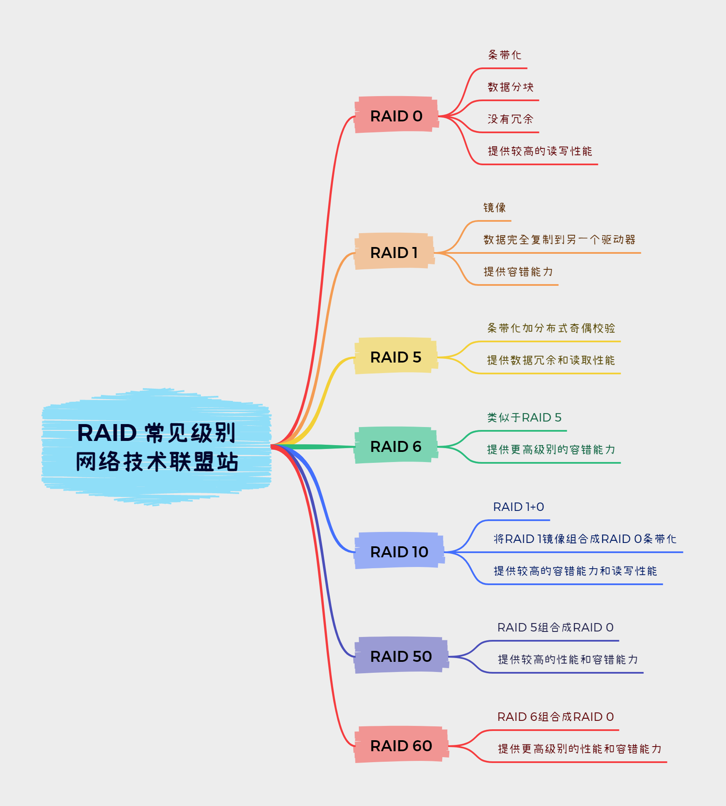

# raid 介绍

[什么是磁盘阵列？15种RAID优缺点详解 · 科技宅小明](https://www.bilibili.com/video/BV1vA411W7yU/)



以下是常见的RAID级别：

```
RAID 0：条带化（数据分块）但没有冗余，提供较高的读写性能。
RAID 1：镜像，数据完全复制到另一个驱动器，提供容错能力。
RAID 5：条带化加分布式奇偶校验，提供数据冗余和读取性能。
RAID 6：类似于RAID 5，但提供更高级别的容错能力。
RAID 10：RAID 1+0，将RAID 1镜像组合成RAID 0条带化，提供较高的容错能力和读写性能。
RAID 50：RAID 5组合成RAID 0，提供较高的性能和容错能力。
RAID 60：RAID 6组合成RAID 0，提供更高级别的性能和容错能力。
```

多的不说，因为我对速度无要求，但对容错有极高的要求，所以选择 RAID 1。

# raid 环境

硬盘选择 3 块相同型号的 500G 机械硬盘，1 块固体装系统电脑硬件选择 i3 5100 + 4G ddr3 （很牢了）。

由于资金不足，只能选择 软Raid，也就是软件模拟 Raid，因此系统选择 Ubuntu 24.04 LTS。

工具则选择 mdadm 以及 cockpit。

# 具体操作

## 系统安装

这不必多说...

## mdadm 安装

```bash
sudo apt install mdadm
```

# 未完待续
